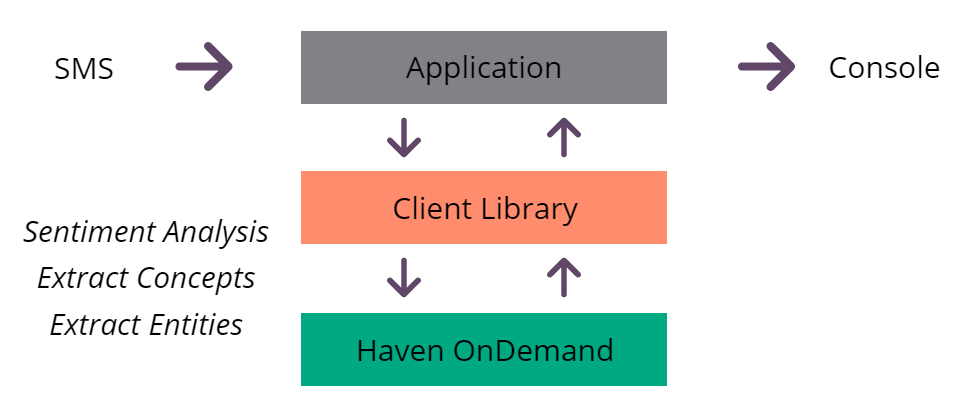

# What this is
Completed code for the tutorial found in the ['Getting up and running with HPE Haven OnDemand' video](http://www.youtube.com/watch?v=https://youtu.be/8aW5XDbd4A8?t=15m32s).

# What this does

Essentials you’ll need to create this app:
* [Node.js](https://nodejs.org/en/) installed on your computer
* [Haven OnDemand account](http://havenondemand.com/) - to perform analysis of text messages
* [Twilio account](https://www.twilio.com ) - to deliver text messages to the webhook
* [ngrok](https://ngrok.com/) - to receive POST requests on local computer from external APIs

To help illustrate how Haven OnDemand’s powerful Text Analysis APIs can be used, we’re going to create a Node.js app from scratch that will receive a text message via [Twilio’s webhook service](https://www.twilio.com/platform/webhooks), analyze the sentiment, using our [Analyze Sentiment API](https://dev.havenondemand.com/apis/analyzesentiment#overview), extract any key concepts, using our [Concept Extraction API](https://dev.havenondemand.com/apis/extractconcepts#overview), and extract any entities (famous people, notable places, companies, organizations), using our [Entity Extraction API](https://dev.havenondemand.com/apis/extractentities#overview), then print all of this information to the console.
